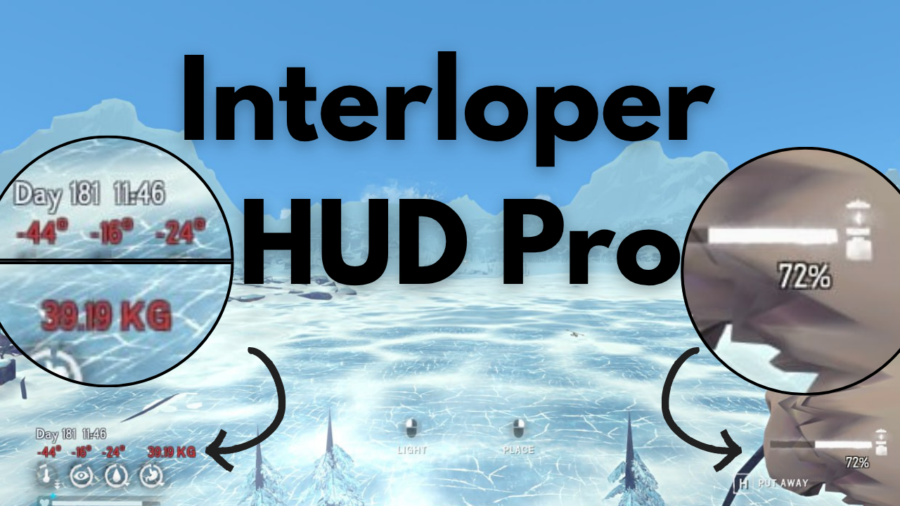

## Interloper Hud Pro

Interloper Hud Pro is a mod for The Long Dark FPS survival game.

Interloper HUD Pro enhances your survival experience on Great Bear Island by adding vital stats directly to your HUD — including:
* Date & Time
* Real-time Temperature
* Inventory Weight
* Active Item Condition
* Breaking ice timer
* Thin ice timer

Stay informed. Stay alive.

## 📊 Features
| Feature | Description |
|----------|--------------|
| 🕒 **Day & Time** | Displays the in-game day and time |
| 🌡️ **Temperature** | Shows `Air Temp` / `Wind Chill` / `Feels like` temperatures Temperature text turns red when `Feels like` goes negative  This is absolutely critical info at Interloper/Misery difficulty to avoid: * 20%/hr cold damage * Hypothermia |
| 🎒 **Inventory Weight** | Keep track of your current carry load |
| 🔧 **Active Item Condition** | Know your item’s remaining durability at a glance   Especially useful to eek out maximum utility for your Torches |
| 🧊 **Ice-Breaking Time** | Extends the selected fishing hole clearing tool name with the estimated time required to break the ice |
| ❄️ **Thin Ice Break Timer** | Displays the remaining time before thin ice breaks under your feet |
| ⚖️ **Automatic Weight Units** | Carried weight is displayed in `KG` or `LBS` depending on the game's measurement unit setting |
| 🎛️ **HUD Customization** | Includes optional sliders to reposition HUD elements and adjust the thin ice timer display |
| 🌐 **Localized Day Label** | The day label adapts to the current game language |

## ⚙️ Configuration

### HUD Customization
Enable **Customize HUD elements** to reveal the following sliders:

| Option | Description |
|----------|--------------|
| **Air temperature position** | Moves the air temperature display left or right |
| **Wind chill position** | Moves the wind chill display left or right |
| **Feels like temperature position** | Moves the feels like temperature display left or right |
| **Carried weight position** | Moves the carried weight display left or right |
| **Held item condition position** | Moves the held item condition display left or right |
| **Thin ice timer size** | Adjusts the font size of the thin ice timer |
| **Thin ice timer vertical offset** | Moves the thin ice timer farther below the warning panel |

## 🧩 HUD Placement Notes
| Element | Description |
|----------|--------------|
| **Main HUD block** | Temperature and weight are displayed together above the vanilla cold meter area |
| **Day & Time** | Shown above the main HUD block |
| **Held Item Condition** | Displayed near the equipped item popup |
| **Thin Ice Timer** | Displayed below the vanilla thin ice warning widget |

## Installation

1. Install MelonLoader.
2. Install [ModSettings](https://github.com/DigitalzombieTLD/ModSettings/).
3. Place `InterloperHudPro.dll` inside your Mods folder.

## 🙏 Special Thanks
To Noname, the original creator of the mod.
